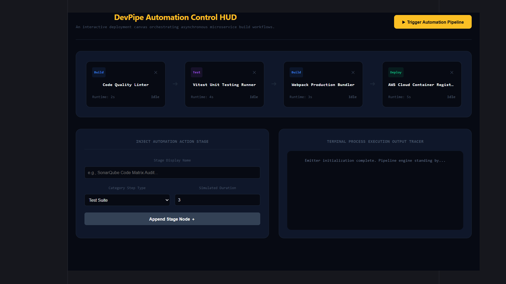

#  DevPipe — Interactive CI/CD Automation Pipeline Studio (React)
-----------------------------------------------------------------------------------------

DevPipe is a responsive frontend orchestration workbench engineered with React. It models complex network task data graphs, integrating state management variables alongside asynchronous runtime delayed timeout functions to process sequential stage progress levels, rendering visual lifecycle pipelines alongside dynamic diagnostic system tracer blocks live.

## Preview
------------------------------------------------------------------------------------------

##  System Architectures Tested
------------------------------------------------------------------------------------------

*  **Sequential State Iterators:** Implements index boundary indicators inside layout loop matrices to advance execution targets step-by-step upon successfully completing tasks.
*  **Self-Cleaning Async Timers:** Handles dynamic browser timeout instances safely inside standard hooks, avoiding race conditions or ghost thread processes on rapid unmounts.

##  Running Instructions
1. Download package files: `npm install`
2. Launch workspace HUD: `npm run dev`
